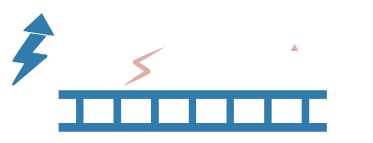

<p align="center">
  <a href="#">
    
  </a>
</p>
<h1 align="center">Flash Betting</h1>
<p align="center">Flash Betting is a web application to trade using the BetFair API. It uses the Streaming API to get live price updates.</p>
<p align="center">Written in pure JS, the Front End is built in React and the backend in Node.js. It is integrated with Electron to run as a desktop application.</p>
<p align="center">Most functionality is implemented, but the app is still in an unfinished state.</p>
<h2 align="center">Features</h2>
<p align="center">
  
  
  
  
  
  
  
  
</p>
<h2 align="center">Technologies used in this project</h2>
<p align="center">
  
  
  
  
  
  
</p>

# Setup

In order to connect to the Betfair API you will need an App Key, and a BetFair username/password.

### App Key
Follow <a href="https://betfair-developer-docs.atlassian.net/wiki/spaces/1smk3cen4v3lu3yomq5qye0ni/pages/2687105/Application+Keys" target="_blank">these</a> instructions to get your app key, you can either use a delayed or live key.
The Live Application Key costs a one time fee of £299 payable to BetFair.

For testing, you can request a delayed key from the BetFair Development team. With a delayed key, market updates are received approximately once per minute.

### Environmental Variables
To configure the environment variables, create a ```.env``` file in the root directory of the project. Use the provided ```example.env``` file as a template to set up your own ```.env``` file. The ```APP_KEY``` variable should be set to your purchased app key from Betfair.

Example:
```bash
APP_KEY=your_app_key_here
```

### Node.js Requirements

Flash Betting requires Node.js version 14.x to 16.x. Ensure that your environment is using one of these supported versions before proceeding with installation.

# Installation (Web)

```bash
$ npm install // Install the dependencies
$ npm run browser // Run the Front End and Local Back End concurrently
```

# Installation (Desktop App)

```bash
$ npm install // Install the dependencies
$ npm run electron-build // Build the .dmg or .exe with Electron Builder
```

# Screenshots


